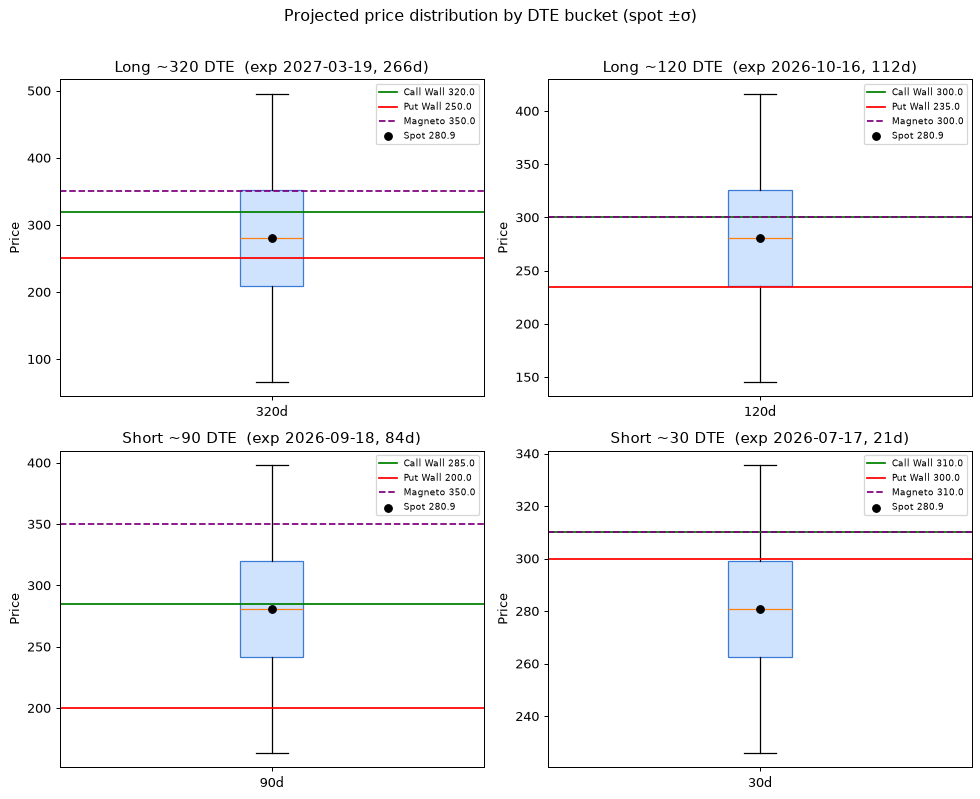

# Drift Sentiment Agent

Analyzes the **Drift Sentiment** of a stock/ETF from its option chain: Put/Call
Walls, Magneto levels, and IV-based price-drift projections. Monthly contracts
only. Includes an interactive TradingView-style price chart where you can toggle
each expiration bucket's projection levels on and off.



---

## 🎓 Student Quick Start (read this first)

You need **3 things**: Python, this code, and your own free Polygon API key.

### 1. Download the code

- Click the green **`Code`** button at the top of this page → **Download ZIP**,
  then unzip it. (Or, if you know git: `git clone <this repo URL>`.)
- Open a terminal **inside** the unzipped folder.

### 2. Get your free Polygon API key

1. Go to **https://polygon.io/** and create a free account.
2. Open your **Dashboard → API Keys** and copy your key.
3. In the project folder, copy `.env.example` to a new file named `.env`:
   ```bash
   cp .env.example .env
   ```
4. Open `.env` and paste your key:
   ```
   POLYGON_API_KEY=your_key_here
   ```

> Your key is personal. Never share it or commit it. The `.env` file is already
> ignored by git so it won't be uploaded if you push your own copy.

### 3. Install and run

```bash
python3 -m venv .venv
.venv/bin/pip install -r requirements.txt
.venv/bin/streamlit run app.py
```

Your browser opens automatically (default http://localhost:8501). Type a ticker
(e.g. `AAPL`), click **Analyze**, and explore.

**Windows note:** use `python -m venv .venv` then `.venv\Scripts\streamlit run app.py`.

---

## What it shows

- **Header metrics:** spot, total shares, total net notional.
- **Sentiment buckets table:** the 4 DTE buckets (320/120/90/30) with Call Wall,
  Put Wall, Magneto, notional, shares, and the 1σ projected move.
- **Interactive price chart:** real candlesticks with toggleable per-bucket
  overlays — Call/Put Walls, Magneto, and ±1σ/±2σ projection lines. Toggle any
  combination of buckets to compare short-term vs long-term targets.
- **Drift classification:** support / rejection / breakout reasoning per bucket.
- **4 box plots:** projected price distribution per DTE bucket.

## How the analysis works

| Concept | Rule |
|---|---|
| **Monthly only** | Expiration on the 3rd Friday of the month; weeklies excluded. |
| **DTE buckets** | Long ~320 & ~120 days, Short ~90 & ~30 days (nearest monthly used). |
| **Call/Put Wall** | Strike with the most open interest, per side, per expiration. |
| **Notional** | `shares × strike`, positive for calls, negative for puts. |
| **Magneto** | Strike with the largest accumulated net notional (the magnet level). |
| **Projection** | `σ = spot × IV_atm × √(DTE/365)` → ±1σ/±2σ price bands. |

## Project layout

```
app.py                     # Streamlit UI
drift_sentiment/
  polygon_client.py        # fetches chain + daily candles (only network module)
  chain_filter.py          # monthly detection + DTE bucketing
  walls.py                 # Call/Put walls
  magneto.py               # shares, notional, magneto
  drift.py                 # drift classification
  stats.py                 # IV std-dev projection
  chart.py                 # interactive TradingView Lightweight-Charts overlay
  plotting.py              # 4 box plots
  report.py                # assembles the report
tests/                     # offline unit tests (no API needed)
```

## Run the tests

```bash
.venv/bin/python -m pytest tests/ -q
```

## Disclaimer

Educational tool for learning options-flow analysis. **Not financial advice.**
Market data is provided by Polygon.io subject to their terms and your plan's
limits (the free tier is delayed/rate-limited).
